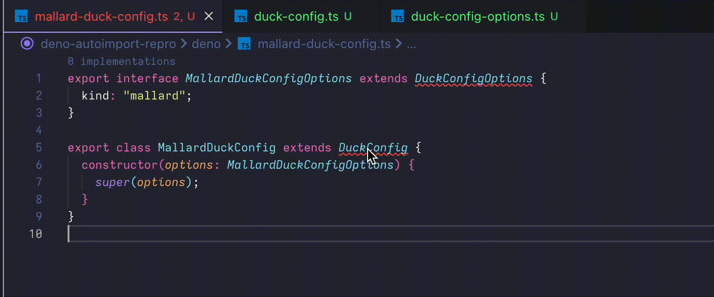

# Deno `Add all missing imports` repro

1. Open project in vscode
2. Navigate to [./deno/mallard-duck-config.ts](./deno/mallard-duck-config.ts)
3. Run "Add all missing imports" quick fix
4. This generates an incorrect import specifier `./duck-config.ts-options`

---

